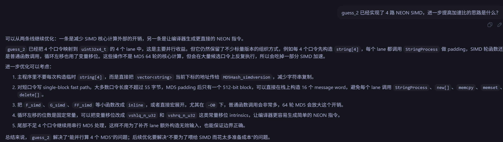
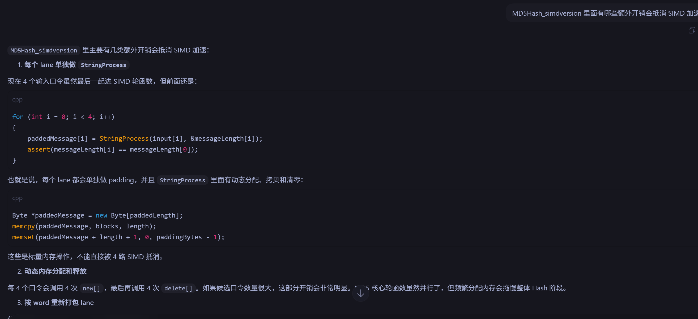
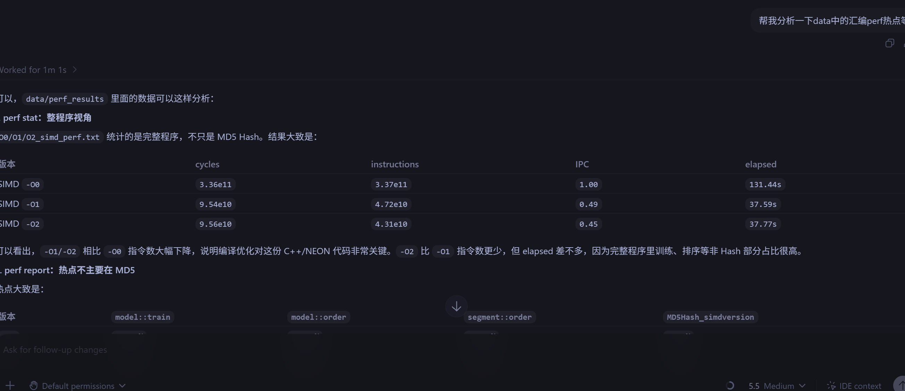

# AI 使用报告

gpt 5.3

本次实验中，`guess_2` 版本的 MD5 SIMD 初步实现由本人手写完成。该版本的核心工作包括将标量 MD5 状态变量改为 `uint32x4_t`，使用 ARM NEON Intrinsics 改写 MD5 的基本逻辑函数和轮函数，并在主程序中按 4 个候选口令一组调用 SIMD 哈希函数。正确性测试、基础运行流程和初步性能测试也主要由本人完成。

在 `guess_2` 之后的进一步加速思路中，我使用 AI 进行了辅助咨询。

AI 主要用于帮助分析初改版中可能存在的额外开销，并提出优化方向，例如减少每 4 个口令打包时的字符串复制、降低 `StringProcess` 动态 padding 的开销、对短口令使用单块 fast path、将 SIMD 小函数内联或宏展开、使用常量移位指令替代变量移位等。随后我根据实验目标和代码结构选择其中可行的优化点，完成代码调整、正确性验证和性能数据整理。

实验报告正文基本由本人手写完成，包括实验背景、算法解释、正确性验证、性能数据整理和 perf 分析。AI 主要辅助完成报告框架梳理、语言组织、LaTeX 语法修改和排版调整，例如章节顺序调整、表格口径统一、摘要后添加仓库链接、页码设置等。报告中的实验结论、加速比数据、perf 结果和最终表述均由本人检查确认。

后面贴AI问答截图：

MD5Hash_simdversion 里面有哪些额外开销会抵消 SIMD 加速？

**MD5Hash_simdversion** 里主要有几类额外开销会抵消 SIMD 加速：

1. **每个 lane 单独做 **StringProcess****

现在 4 个输入口令虽然最后一起进 SIMD 轮函数，但前面还是：

`for (int i = 0; i < 4; i++) {     paddedMessage[i] = StringProcess(input[i], &messageLength[i]);     assert(messageLength[i] == messageLength[0]); } `

也就是说，每个 lane 都会单独做 padding，并且 **StringProcess** 里面有动态分配、拷贝和清零：

`Byte *paddedMessage = new Byte[paddedLength]; memcpy(paddedMessage, blocks, length); memset(paddedMessage + length + 1, 0, paddingBytes - 1); `

这些是标量内存操作，不能直接被 4 路 SIMD 抵消。

2. **动态内存分配和释放**

每 4 个口令会调用 4 次 **new[]**，最后再调用 4 次 **delete[]**。如果候选口令数量很大，这部分开销会非常明显。MD5 核心轮函数虽然并行了，但频繁分配内存会拖慢整体 Hash 阶段。

3. **按 word 重新打包 lane**

代码里每个 block 的 16 个 word 都要这样构造：

`for (int i1 = 0; i1 < 16; ++i1) {     for (int lane = 0; lane < 4; lane++)     {         lanes[lane] = DecodeWord(paddedMessage[lane], 4 * i1 + i * 64);     }     x[i1] = vld1q_u32(lanes); } `

这一步本质上是在把 4 个标量消息块转置成 SIMD lane 布局。它是必要的，但如果前面已经动态生成了 4 份 padded message，再逐字读取和 **vld1q_u32**，也会有额外访存成本。

4. **SIMD 轮函数是普通函数调用**

例如：

`FF_simd(&a, b, c, d, x[0], s11, 0xd76aa478); `

如果 **FF_simd**、**F_simd**、**ROTATELEFT_simd** 没有被内联，64 轮会产生大量函数调用。**-O1**、**-O2** 下编译器可能会自动内联，但 **-O0** 下通常不会，所以 **-O0** 的 SIMD 版本很可能反而更慢。

5. **变量移位实现循环左移**

当前 **ROTATELEFT_simd** 如果使用 **vshlq_u32(num, vdupq_n_s32(n))** 这种变量移位，就需要额外构造移位控制向量。MD5 每轮的移位数其实是编译期常量，用 **vshlq_n_u32** / **vshrq_n_u32** 会更直接。

所以总结一下：**MD5Hash_simdversion** 的核心 64 轮确实并行了，但 padding、内存分配、lane 打包、函数调用和变量移位这些外围成本还在。进一步优化应该优先减少这些非核心开销。

帮我分析一下data中的汇编perf热点等

**Worked for 1m 1s**

可以，**data/perf_results** 里面的数据可以这样分析：

**1. perf stat：整程序视角**

**O0/O1/O2_simd_perf.txt** 统计的是完整程序，不只是 MD5 Hash。结果大致是：

| 版本              | cycles            | instructions      | IPC            | elapsed           |
| ----------------- | ----------------- | ----------------- | -------------- | ----------------- |
| SIMD**-O0** | **3.36e11** | **3.37e11** | **1.00** | **131.44s** |
| SIMD**-O1** | **9.54e10** | **4.72e10** | **0.49** | **37.59s**  |
| SIMD**-O2** | **9.56e10** | **4.31e10** | **0.45** | **37.77s**  |

可以看出，**-O1/-O2** 相比 **-O0** 指令数大幅下降，说明编译优化对这份 C++/NEON 代码非常关键。**-O2** 比 **-O1** 指令数更少，但 elapsed 差不多，因为完整程序里训练、排序等非 Hash 部分占比很高。

**2. perf report：热点不主要在 MD5**

热点大致是：

| 版本          | **model::train** | **model::order** | **segment::order** | **MD5Hash_simdversion** |
| ------------- | ---------------------- | ---------------------- | ------------------------ | ----------------------------- |
| **-O0** | **54.86%**       | **23.06%**       | **15.82%**         | **7.71%**               |
| **-O1** | **53.46%**       | **20.89%**       | **20.73%**         | **3.66%**               |
| **-O2** | **54.34%**       | **20.54%**       | **19.43%**         | **2.74%**               |

这说明整程序主要热点在 PCFG 的训练和排序上，不在 MD5。**MD5Hash_simdversion** 在 **-O2** 下只占 **2.74%**，说明 Hash 阶段已经被 SIMD 压下去了。也能解释为什么 Hash time 加速比能到 2.x，但完整程序总时间变化没有那么明显。

**3. 排序开销很重**

**perf report** 里 **segment::order** 下面有大量：

`std::__introsort_loop std::sort `

说明 PCFG 模型里排序字符串段、概率结构等操作占了大量时间。这部分和 SIMD MD5 无关，所以继续优化 MD5 对完整程序 elapsed 的帮助会越来越小。

**4. 汇编证明 SIMD 生效**

**O2_simd_main.asm** 里能看到大量 NEON 向量指令，例如：

`add  v0.4s, v7.4s, v0.4s shl  v3.4s, v0.4s, #7 ushr v0.4s, v0.4s, #25 orr  v0.16b, v3.16b, v0.16b eor  v1.16b, v1.16b, v10.16b `

这些对应 MD5 的 32-bit 加法、循环左移和位运算。**v?.4s** 表示 4 个 32-bit lane 同时计算，说明编译器确实生成了 NEON SIMD 指令，而不是退化成 4 次标量 MD5。

**可以写进报告的结论**

当前 SIMD 优化是有效的：汇编中能看到 NEON 向量指令，Hash time 也明显下降。但 perf report 显示完整程序热点主要集中在 **model::train**、**model::order** 和 **segment::order**，所以整程序总时间不会按 Hash 加速比同比例下降。后续如果想继续优化总运行时间，应该优先考虑 PCFG 训练和排序，而不是继续只优化 MD5。
